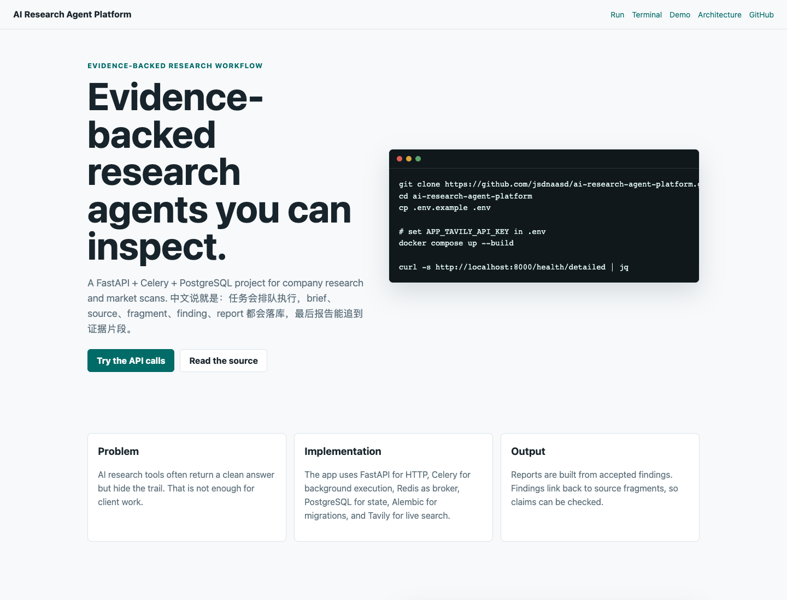
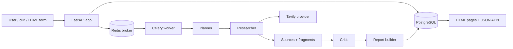

# AI Research Agent Platform

Supervised research-agent backend for creating evidence-backed market or company reports.

中文说明：这是一个后端工程项目，用 FastAPI、Celery、PostgreSQL 和 Redis 组织一次 research job。系统会保存 task、brief、source、source fragment、finding 和 report，让报告结论可以回到来源片段。

[Project page](https://jsdnaasd.github.io/ai-research-agent-platform/) · [Repository](https://github.com/jsdnaasd/ai-research-agent-platform)

<p align="center">
  
</p>

## What Is Implemented

- FastAPI app with HTML pages and JSON APIs.
- Celery worker for background research jobs.
- Redis broker for task queueing.
- PostgreSQL persistence through SQLAlchemy models.
- Alembic migrations for database schema.
- Planner, researcher, critic, and report-builder stages.
- Tavily search provider interface for live web search.
- Stored sources and source fragments before report generation.
- Findings linked back to supporting source fragments.
- Health checks, task status APIs, and artifact inspection routes.
- Pytest coverage for API, models, orchestration, worker enqueueing, web pages, and provider validation.
- Static GitHub Pages project page in [`io/`](io/).

中文：

- FastAPI 提供 HTML 页面和 JSON API。
- Celery worker 执行后台 research job。
- Redis 作为任务队列 broker。
- PostgreSQL 保存任务和研究过程产物。
- Alembic 管理数据库迁移。
- 流程拆成 planner、researcher、critic、report builder。
- 通过 Tavily provider 做真实搜索接口。
- 在生成报告前保存 source 和 source fragment。
- finding 会关联到支撑它的来源片段。
- 提供 health check、任务状态、brief、evidence、report 等接口。
- 测试覆盖 API、模型、编排、worker、页面和搜索 provider。
- [`io/`](io/) 目录提供静态项目页。

## Architecture



The important design decision is that intermediate artifacts are persisted. A report is not only a final markdown string; the database also keeps the briefs, sources, fragments, findings, critic status, and failure states used to produce it.

中文：这个项目的重点不是只生成一段总结，而是把中间产物保存下来。报告之外，数据库还保存 brief、source、fragment、finding、critic 状态和失败状态。

## Main Routes

```text
GET  /
GET  /health
GET  /health/detailed
POST /api/tasks
GET  /api/tasks
GET  /api/tasks/{id}
GET  /api/tasks/{id}/briefs
GET  /api/tasks/{id}/evidence
GET  /api/tasks/{id}/report
GET  /tasks/{id}
GET  /tasks/{id}/briefs
GET  /tasks/{id}/evidence
GET  /tasks/{id}/report
```

## Quick Start With Docker

Docker is the easiest path because the app expects PostgreSQL, Redis, FastAPI, and a Celery worker.

```bash
git clone https://github.com/jsdnaasd/ai-research-agent-platform.git
cd ai-research-agent-platform

cp .env.example .env
```

Edit `.env` and set:

```text
APP_TAVILY_API_KEY=your-tavily-api-key
```

Start the stack:

```bash
docker compose up --build
```

Open:

```text
http://localhost:8000
http://localhost:8000/health
http://localhost:8000/health/detailed
```

Watch worker logs:

```bash
docker compose logs -f worker
```

Stop:

```bash
docker compose down
```

## Local Python Setup

```bash
python -m venv .venv
source .venv/bin/activate
pip install -e ".[dev]"
```

Run migrations:

```bash
alembic upgrade head
```

Start API:

```bash
uvicorn app.main:app --reload
```

Start worker in another terminal:

```bash
celery -A app.worker.celery_app worker --loglevel=info
```

## Make Commands

```bash
make install
make migrate
make run
make worker
make test
make docker-up
make docker-down
```

## Create A Research Task

```bash
curl -s -X POST http://localhost:8000/api/tasks \
  -H "content-type: application/json" \
  -d '{
    "topic": "OpenAI competitors",
    "template_type": "market_scan",
    "user_context": "Focus on SMB pricing, positioning, and evidence quality."
  }' | jq
```

Check the task:

```bash
TASK_ID="paste-returned-id-here"

curl -s "http://localhost:8000/api/tasks/$TASK_ID" | jq
curl -s "http://localhost:8000/api/tasks/$TASK_ID/briefs" | jq
curl -s "http://localhost:8000/api/tasks/$TASK_ID/evidence" | jq
curl -s "http://localhost:8000/api/tasks/$TASK_ID/report" | jq -r .markdown_content
```

## Tests

Run the full test suite:

```bash
pytest -v
```

Useful focused checks:

```bash
pytest tests/api -v
pytest tests/integration/test_persisted_task_flow.py -v
pytest tests/services/test_orchestrator_rounds.py -v
pytest tests/tools/test_tavily_search_provider.py -v
pytest tests/web/test_task_pages.py -v
```

Static project page check:

```bash
python3 -m http.server 5173 --directory io
curl -I http://localhost:5173
```

## Database Inspection

With Docker running:

```bash
docker compose exec db psql -U postgres -d research_agent
```

Useful queries:

```sql
select id, topic, status, created_at, updated_at
from research_tasks
order by created_at desc
limit 5;
```

```sql
select task_id, question, status
from research_briefs
order by created_at desc
limit 10;
```

```sql
select f.claim, s.title, sf.fragment_text
from research_findings f
join research_finding_source_fragments link on link.finding_id = f.id
join research_source_fragments sf on sf.id = link.source_fragment_id
join research_sources s on s.id = sf.source_id
limit 10;
```

## Known Limitations

- The project needs PostgreSQL and Redis for the full workflow.
- Real research tasks require a Tavily API key.
- There is no authentication or multi-user permission model yet.
- The search provider abstraction exists, but only the Tavily path is implemented.
- The critic is rule/schema oriented; it is not a full evaluation framework.
- The GitHub Pages site is a static project page, not the running backend.
- No production deployment manifests are included beyond Docker Compose.

中文限制：

- 完整流程需要 PostgreSQL 和 Redis。
- 真实搜索任务需要 Tavily API key。
- 目前没有用户认证和多租户权限。
- 搜索 provider 有抽象，但当前主要实现 Tavily。
- critic 还不是完整评测系统。
- GitHub Pages 只是静态项目页，不是后端服务本身。
- 除 Docker Compose 外，还没有生产部署配置。

## Roadmap

- Add authentication and per-user task ownership.
- Add more search providers.
- Add retry and rate-limit controls around search calls.
- Add report export formats.
- Add source quality scoring.
- Add a small evaluation dataset for research quality.
- Add deployment notes for a cloud VM or container platform.

中文下一步：

- 增加认证和任务归属。
- 增加更多搜索 provider。
- 给搜索调用加重试和限速。
- 支持报告导出。
- 增加来源质量评分。
- 增加研究质量评测样例。
- 补充云服务器或容器平台部署说明。
